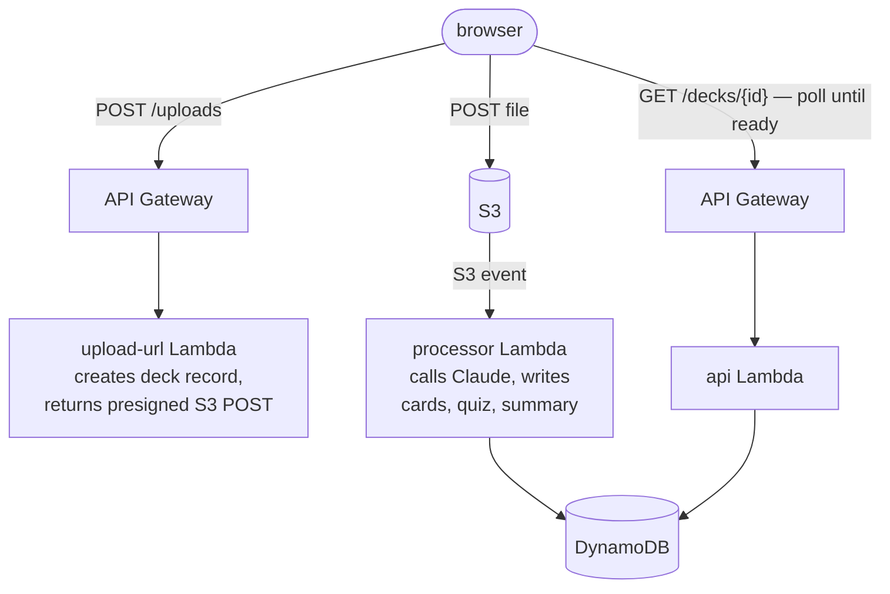

# engram

Turn anything you read into memories that stick.

Upload a PDF, a photo of handwritten notes, or a plain text file. Claude reads it
and writes you a study pack: flashcards, a multiple-choice quiz, and a summary.
Engram grades your quiz attempts server-side and keeps a score history for every
deck.

## How it works



One constraint shapes the whole design: Claude can take a minute or more to write
a study pack, but API Gateway cuts every request off at 30 seconds. So the upload
returns immediately, processing runs off an S3 event, and the frontend polls the
deck until its status flips to `ready`.

## Repository layout

npm workspaces, TypeScript everywhere.

| Package               | What it is                                                                                                                                     |
| --------------------- | ---------------------------------------------------------------------------------------------------------------------------------------------- |
| `shared`              | Types, Zod schemas, and DynamoDB key helpers. The single source of truth the other packages import.                                            |
| `infra`               | AWS CDK app with three stacks: `EngramData` (DynamoDB, S3, Cognito), `EngramApi` (HTTP API + Lambdas), `EngramProcessing` (the Claude worker). |
| `services/upload-url` | Creates the deck record and a presigned S3 POST, capped at 20 MB.                                                                              |
| `services/processor`  | S3-triggered. Fetches the Anthropic key from SSM, calls Claude (`claude-opus-4-8`), writes the results.                                        |
| `services/api`        | Deck reads and server-side quiz grading, behind a Cognito JWT authorizer.                                                                      |
| `web`                 | Next.js app: upload, flashcards, quiz, attempt history.                                                                                        |

## API

| Route                           | Purpose                                             |
| ------------------------------- | --------------------------------------------------- |
| `POST /uploads`                 | Create a deck record, get a presigned upload        |
| `GET /decks`                    | List your decks                                     |
| `GET /decks/{deckId}`           | Deck with cards and quiz (answers stay server-side) |
| `POST /decks/{deckId}/attempts` | Submit answers, get a graded result                 |
| `GET /decks/{deckId}/attempts`  | Your attempt history                                |

Every route sits behind a Cognito JWT authorizer.

## Running it yourself

You need Node 20+, an AWS account with CDK bootstrapped, and an Anthropic API key.

```bash
npm install

# the processor reads the API key from SSM at runtime
aws ssm put-parameter \
  --name /engram/anthropic-api-key \
  --type SecureString \
  --value sk-ant-your-key

# deploy all three stacks; CDK resolves the dependency order
cd infra
npm run cdk -- deploy --all
```

Point the web app at what you just deployed. In `web/.env.local`:

```bash
NEXT_PUBLIC_API_URL=             # your EngramApi endpoint
NEXT_PUBLIC_USER_POOL_ID=        # from EngramData
NEXT_PUBLIC_USER_POOL_CLIENT_ID= # from EngramData
```

Then:

```bash
cd web
npm run dev
```

Sign up, confirm the emailed code, and drop in something worth remembering.

## Development

```bash
npm run typecheck   # all workspaces
npm test            # all workspaces (shared has the schema tests)
```

The web app has its own `dev`, `build`, and `lint` scripts.

A few conventions the code holds to. Zod parses everything that crosses a
trust boundary, whether it came back from Claude or arrived in a request body.
DynamoDB uses a single-table design, and the key helpers in `shared` are the
only way any package touches it. Secrets stay in SSM Parameter Store and never
land in code or committed env files.

## License

MIT. See [LICENSE](LICENSE).
